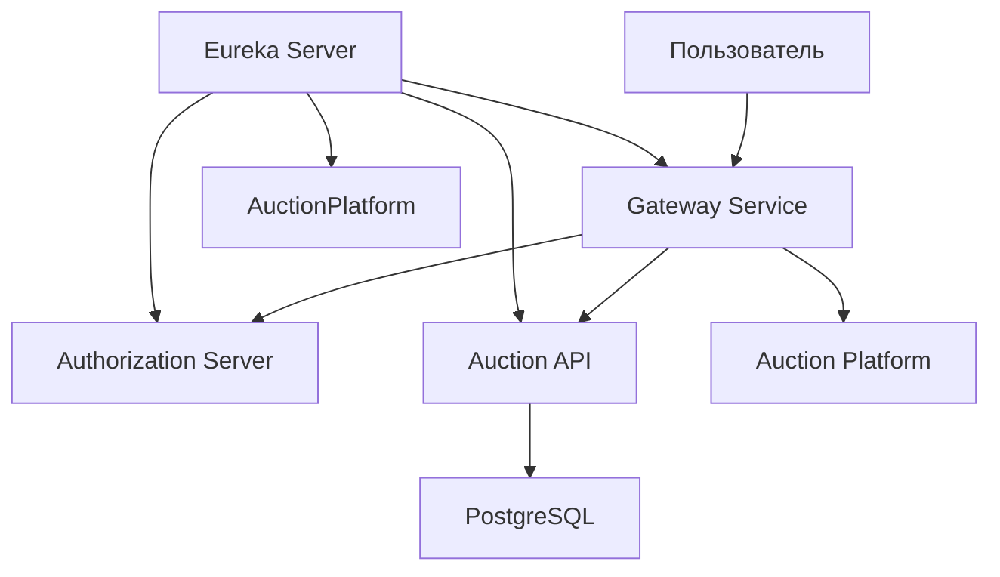

# 📦 Проектная работа "Платформа для Аукциона" 🛠️

## 📄 Описание проекта

**"Платформа для Аукциона"** — этот проект представляет собой платформу для проведения аукционов, построенную на микросервисной архитектуре с использованием Spring Cloud. Проект включает в себя несколько микросервисов, которые взаимодействуют друг с другом для обеспечения функциональности аукциона.

---

## 🔧 Основные компоненты проекта

### 1. **Gateway Service**
- **Описание**: Сервис-шлюз для маршрутизации запросов.
- **Технологии**: Spring Cloud Gateway, JWT, Eureka Client.
- **Функциональность**:
  - Направление запросов на нужные микросервисы.
  - Обеспечение безопасности через JWT.

### 2. **Authorization Server**
- **Описание**: Сервис для управления пользователями и токенами.
- **Технологии**: Spring Security, PostgreSQL, Flyway.
- **Функциональность**:
  - Регистрация пользователей.
  - Аутентификация с использованием JWT.

### 3. **Auction Platform**
- **Описание**: Веб-интерфейс для взаимодействия пользователей с аукционом.
- **Технологии**: Spring Boot, Thymeleaf, Feign, Resilience4j.
- **Функциональность**:
  - Участие в торгах.
  - Отправка заявок на участие.
  - Управление ставками.

### 4. **Auction API**
- **Описание**: Сервис для управления данными аукциона.
- **Технологии**: Spring Boot, JPA, PostgreSQL, Flyway.
- **Функциональность**:
  - Управление лотами, участниками и ставками.
  - API для других сервисов.

### 5. **Eureka Server**
- **Описание**: Централизованный сервер для обнаружения сервисов.
- **Технологии**: Spring Cloud Netflix Eureka.

---

## 🏗️ Архитектура проекта

Проект построен на основе микросервисной архитектуры. Компоненты взаимодействуют через **Eureka Server** и **Spring Cloud Gateway**:

1. **Gateway Service** обрабатывает все входящие запросы.
2. **Authorization Server** управляет аутентификацией пользователей.
3. **Auction Platform** предоставляет интерфейс для взаимодействия с пользователями.
4. **Auction API** управляет данными аукциона.
5. **Eureka Server** отвечает за обнаружение и регистрацию сервисов.

---

## 📚 Схема взаимодействия компонентов



---

## 💻 Технологический стек

**Основные технологии**:
- Язык программирования: Java 17
- Фреймворк: Spring Boot 3.1.2, Spring Cloud
- База данных: PostgreSQL
- Миграции БД: Flyway
- Аутентификация: Spring Security, JWT
- Шлюз: Spring Cloud Gateway
- Обнаружение сервисов: Eureka
- Клиент для микросервисов: Feign
- Устойчивость: Resilience4j
- Шаблонизатор: Thymeleaf
- Сборка: Maven
- Логирование: SLF4J, Logback
- Тестирование: JUnit 5, MockMvc
- Контейнеризация: Docker

**Библиотеки**:
- Lombok — удобное сокращение кода.
- JJWT — работа с JWT.
- Jackson — парсинг JSON.
- Hibernate — ORM для работы с базой данных.
- Webjars — для подключения CSS и JS, включая Bootstrap.

**Дополнительные технологии**:
- Frontend: HTML, CSS, Bootstrap.
- Безопасность: CSRF (Cross-Site Request Forgery), CORS (Cross-Origin Resource Sharing).
- Инструменты разработки: Checkstyle.
- Развертывание: Docker.
- Профилирование: Spring Profiles.

---

## 🚀 Установка и запуск

**Клонирование репозитория**:
```bash
git clone https://github.com/Dantsy/auction.git
cd auction
```

**Сборка проекта**:
```bash
mvn clean install
```

**Запуск сервисов**:

- **Eureka Server**:
  ```bash
  cd eureka-server
  mvn spring-boot:run
  ```

- **Gateway Service**:
  ```bash
  cd gateway-service
  mvn spring-boot:run
  ```

- **Authorization Server**:
  ```bash
  cd authorization-server
  mvn spring-boot:run
  ```

- **Auction Platform**:
  ```bash
  cd auction-platform
  mvn spring-boot:run
  ```

- **Auction API**:
  ```bash
  cd auction-api
  mvn spring-boot:run
  ```

**Доступ**:
Перейдите в браузере по адресу: [http://localhost:8080/auction](http://localhost:8080/auction)

---

## 🔍 Тестирование

Для запуска тестов используйте:

```bash
mvn test
```

---

## 🔗 Эндпоинты приложения

**Gateway Service**:
- `/auth/**` - маршруты для аутентификации и регистрации.
- `/auction/**` - маршруты для работы с аукционом.
- `/api/**` - маршруты для данных аукциона.

**Authorization Server**:
- `/auth/sign-up` - регистрация пользователя.
- `/auth/sign-in` - вход пользователя.

**Auction Client**:
- `/auction` - главная страница.
- `/auction/login` - вход в систему.
- `/auction/register` - регистрация нового пользователя.
- `/auction/form` - подача заявки на участие.
- `/auction/cabinet` - личный кабинет.
- `/auction/admin` - админ-панель.

**Auction API**:
- `/api/questions` - вопросы участников.
- `/api/questions/{id}` - вопрос по ID.
- `/api/bidders` - список участников.
- `/api/auction-items` - список лотов.

---

## 📬 Контакты

Если у вас есть вопросы, предложения или проблемы, пишите:

- Email: dantsy@yandex.ru
- GitHub: Dantsy

🤝 Буду рад вашим отзывам и предложениям!

